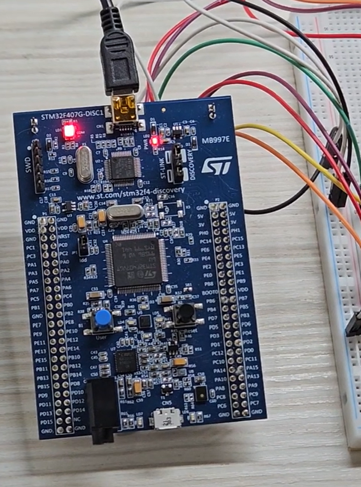
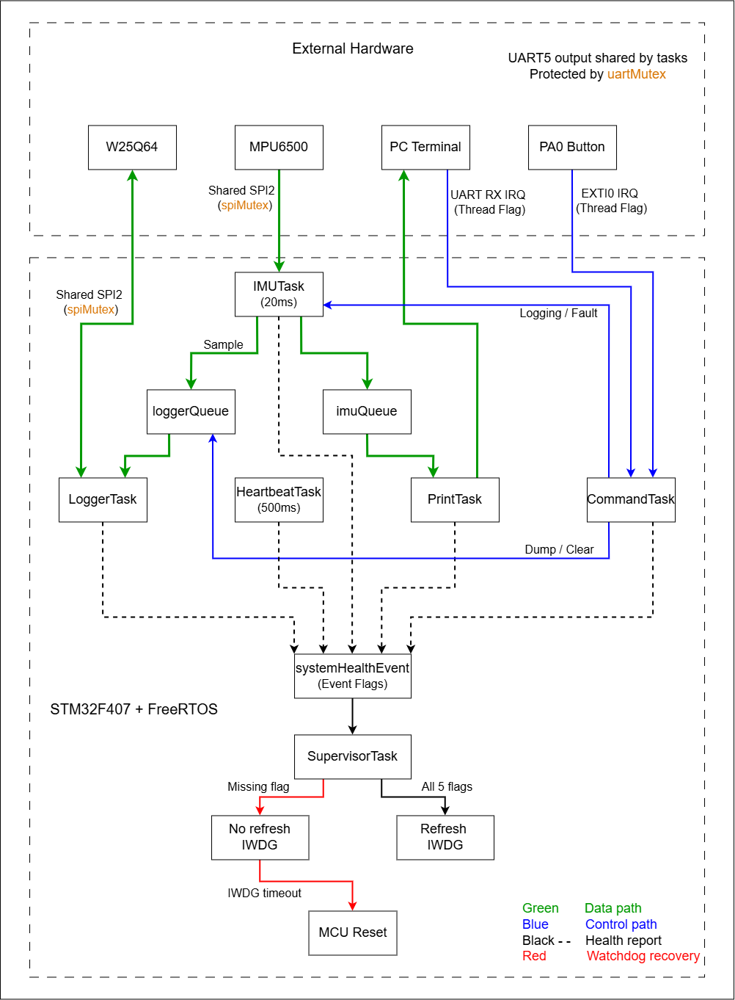
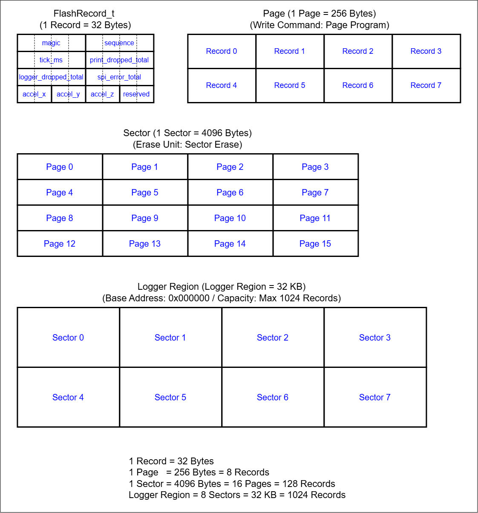

# STM32F407 FreeRTOS IMU Data Logger

## Overview

This project implements a real-time IMU data logging system on the STM32F407 using FreeRTOS through the CMSIS-RTOS2 API.

The system periodically samples 3-axis acceleration data from an MPU6500 at **50 Hz**, distributes the sampled data to multiple RTOS tasks through message queues, displays runtime information through UART5, and stores selected samples into a W25Q64 SPI Flash.

The project also provides a UART command interface for controlling the logger, reading stored records, clearing Flash memory, checking system status, and injecting a simulated task-health fault.

A dedicated `SupervisorTask` monitors the health of critical tasks using Event Flags. The Independent Watchdog (IWDG) is refreshed only when all monitored tasks report healthy. If a task fails to report its health status, the watchdog is intentionally not refreshed and the MCU is automatically reset.

The main purpose of this project is to integrate multiple STM32 and RTOS concepts into one complete embedded system instead of demonstrating each peripheral or RTOS mechanism independently.

---

## Demo

This demo shows:

- Running the FreeRTOS-based IMU data logger on STM32F407
- Reading MPU6500 acceleration data at 50 Hz
- Sharing SPI2 between MPU6500 and W25Q64 using `spiMutex`
- Monitoring system status through UART5
- Starting Flash logging through UART commands
- Automatically stopping logging when the logger reaches 1024 records
- Reading stored records using `dump N`
- Clearing the logger region using `clear`
- Starting and stopping logging using the PA0 button
- Handling PA0 events through EXTI and Thread Flags
- Injecting an IMU health-reporting fault using `fault imu`
- Detecting a missing health flag through `SupervisorTask`
- Stopping IWDG refresh when the system becomes unhealthy
- Resetting the MCU through IWDG timeout
- Detecting the IWDG reset cause and recovering to normal operation

[Watch the demo video](https://youtu.be/qdfOgjXE6XQ)

<a href="https://youtu.be/qdfOgjXE6XQ">
  
</a>

---

## Hardware

| Component | Usage |
|---|---|
| STM32F407G-DISC1 | Main development board |
| STM32F407VGT6U | Main MCU |
| MPU6500 | 3-axis acceleration sampling |
| W25Q64 | External SPI Flash storage |
| UART5 | PC terminal interface |
| PA0 Button | Start / stop logging |
| Green LED | System heartbeat indication |
| Orange LED | IMU output indication |
| IWDG | System fault recovery |

### Main Interfaces

| Interface | Usage |
|---|---|
| SPI2 | Shared by MPU6500 and W25Q64 |
| UART5 | PC terminal communication |
| PA0 / EXTI0 | User button interrupt |
| IWDG | Hardware watchdog |

UART5 configuration:

```text
Baud Rate : 115200
Data Bits : 8
Parity    : None
Stop Bits : 1
```

The MPU6500 and W25Q64 share the same SPI2 bus and use separate chip-select signals.

Access to SPI2 is protected by `spiMutex`.

UART5 output is shared by multiple tasks and protected by `uartMutex`.

---

## Development Environment

- Board: STM32F407G-DISC1
- MCU: STM32F407VGT6U
- IDE: Keil uVision / MDK-ARM
- Configuration Tool: STM32CubeMX
- RTOS: FreeRTOS
- RTOS API: CMSIS-RTOS2
- STM32 HAL
- Debugger / Programmer: ST-LINK

---

## Features

- FreeRTOS multitasking using CMSIS-RTOS2
- 50 Hz periodic MPU6500 acceleration sampling
- Fixed-period scheduling using `osDelayUntil()`
- Producer / consumer communication using Message Queues
- Separate queues for runtime data output and Flash logging
- Tagged logger messages for `SAMPLE`, `DUMP`, and `CLEAR`
- Shared SPI2 bus protected by Mutex
- Shared UART5 output protected by Mutex
- UART5 interrupt-based command reception
- PA0 external interrupt control
- Thread Flags for ISR-to-task notification
- Event Flags for multi-task health monitoring
- W25Q64 Page Program, Read, and Sector Erase
- 32-byte aligned Flash record format
- 8-sector / 32 KB logger region
- Up to 1024 stored IMU records
- UART commands for logger control
- Independent Watchdog fault recovery
- Watchdog reset-cause detection
- UART-based fault injection for watchdog testing

---

## System Architecture

The application is divided into independent RTOS tasks with clearly separated responsibilities.



The system contains six tasks:

- `IMUTask`
- `PrintTask`
- `LoggerTask`
- `CommandTask`
- `HeartbeatTask`
- `SupervisorTask`

The main data path is:

```text
MPU6500
   |
   v
IMUTask
   |
   +----> imuQueue ------> PrintTask ------> UART5
   |
   +----> loggerQueue ---> LoggerTask <---> W25Q64
```

The control path is:

```text
PC Terminal ---- UART RX IRQ / Thread Flag ---\
                                               \
                                                > CommandTask
                                               /
PA0 Button ----- EXTI0 IRQ / Thread Flag -----/
```

`CommandTask` controls logging state and can also send `DUMP` and `CLEAR` requests to `LoggerTask`.

---

## RTOS Task Design

| Task | Priority | Main Responsibility |
|---|---|---|
| `SupervisorTask` | High | Monitor task health and control IWDG refresh |
| `IMUTask` | Above Normal | Sample MPU6500 every 20 ms |
| `PrintTask` | Normal | Consume IMU data and output runtime information |
| `CommandTask` | Normal | Handle PA0 button and UART commands |
| `LoggerTask` | Below Normal | Handle W25Q64 logging, dump, and clear operations |
| `HeartbeatTask` | Low | Toggle heartbeat LED and report task health |

### Priority Design

`SupervisorTask` has the highest priority because it is responsible for system health monitoring and watchdog control. It normally remains blocked while waiting for Event Flags, so it does not continuously consume CPU time.

`IMUTask` has an Above Normal priority because maintaining the 50 Hz sampling period is more time-sensitive than UART output or Flash storage.

`PrintTask` and `CommandTask` use Normal priority because they handle general runtime output and user interaction.

`LoggerTask` runs at Below Normal priority because Flash logging is less time-critical than sensor acquisition.

`HeartbeatTask` has the lowest priority because LED indication is not time-critical.

---

## RTOS Objects

### imuQueue

`imuQueue` transfers `IMUData_t` samples from `IMUTask` to `PrintTask`.

```text
IMUTask
   |
   | IMUData_t
   v
imuQueue
   |
   v
PrintTask
```

Queue depth:

```text
16 samples
```

`IMUTask` inserts data using a zero timeout.

If the queue becomes full, the high-priority sampling task does not wait. Instead, the dropped-sample counter is incremented.

This prevents a slow consumer from delaying the 50 Hz sensor acquisition period.

---

### loggerQueue

`loggerQueue` transfers `LoggerMessage_t` messages to `LoggerTask`.

Queue depth:

```text
32 messages
```

Each message contains a message type:

```c
typedef enum
{
    LOGGER_MESSAGE_SAMPLE = 0,
    LOGGER_MESSAGE_DUMP,
    LOGGER_MESSAGE_CLEAR

} LoggerMessageType_t;
```

The logger queue therefore carries both data messages and control messages.

```text
IMUTask -------- SAMPLE ------┐
                              |
                              |
                              v
                         loggerQueue --------> LoggerTask
                              ^
                              |
                              |
CommandTask ----- DUMP -------|
            ----- CLEAR ------|
```

Because the queue is FIFO, previously queued samples are processed before a later `DUMP` or `CLEAR` request.

This keeps all W25Q64 operations serialized inside `LoggerTask`.

---

## Shared Resource Protection

### SPI Mutex

The MPU6500 and W25Q64 share SPI2.

Both `IMUTask` and `LoggerTask` may access the SPI peripheral, so the shared bus is protected using `spiMutex`.

```text
IMUTask -----\
              >---- spiMutex ---- SPI2
LoggerTask --/
```

This prevents two tasks from using SPI2 at the same time.

During W25Q64 Page Program or Sector Erase operations, the Flash performs part of the operation internally.

The SPI bus is released while the Flash is busy. `LoggerTask` periodically checks the W25Q64 BUSY status and uses `osDelay(1)` between checks so other tasks can continue running.

---

### UART Mutex

UART5 output is shared by multiple tasks.

`uartMutex` ensures that a complete UART message is transmitted without another task mixing its output into the same message.

```text
IMUTask
PrintTask
LoggerTask
CommandTask
SupervisorTask
     |
     v
 uartMutex
     |
     v
   UART5
```

---

## IMU Sampling

`IMUTask` reads acceleration data from the MPU6500 every 20 ms.

```text
20 ms period
= 50 Hz sampling rate
```

The periodic timing is implemented using:

```c
nextWakeTick += 20U;
osDelayUntil(nextWakeTick);
```

Using `osDelayUntil()` keeps the sampling schedule based on an absolute timing reference and reduces long-term timing drift caused by task execution time.

Each successful sample contains:

```c
typedef struct
{
    uint32_t sequence;
    uint32_t tick_ms;

    uint32_t print_dropped_total;
    uint32_t logger_dropped_total;
    uint32_t spi_error_total;

    int16_t accel_x;
    int16_t accel_y;
    int16_t accel_z;

} IMUData_t;
```

`IMUTask` always sends the sample to `imuQueue`.

When logging is enabled, the same sample is also wrapped in a `LOGGER_MESSAGE_SAMPLE` message and sent to `loggerQueue`.

---

## Print Task

`PrintTask` consumes every sample successfully queued in `imuQueue`.

The task prints one sample for every 25 received samples.

Since the IMU sampling frequency is 50 Hz:

```text
25 samples / 50 Hz
= one UART output every 500 ms
```

Example:

```text
SEQ=250, T=5187 ms, AX=75 mg, AY=-137 mg, AZ=-932 mg, PDROP=0, LDROP=0, SPIERR=0
```

The counters provide runtime diagnostics:

| Field | Meaning |
|---|---|
| `PDROP` | Samples dropped because `imuQueue` was full |
| `LDROP` | Samples dropped because `loggerQueue` was full |
| `SPIERR` | MPU6500 SPI read errors |

The Orange LED toggles whenever a sample is printed.

---

## Flash Memory Layout

Each stored sample uses a fixed-size `FlashRecord_t`.



The record structure is:

```c
typedef struct
{
    uint32_t magic;

    uint32_t sequence;
    uint32_t tick_ms;

    uint32_t print_dropped_total;
    uint32_t logger_dropped_total;
    uint32_t spi_error_total;

    int16_t accel_x;
    int16_t accel_y;
    int16_t accel_z;

    uint16_t reserved;

} FlashRecord_t;
```

The record size is:

```text
32 Bytes
```

The `reserved` field keeps the structure aligned to exactly 32 bytes.

---

### Magic Number

Every record contains:

```c
#define FLASH_RECORD_MAGIC 0x31554D49UL
```

The value is checked when records are read back.

It helps distinguish valid logger records from erased or invalid Flash contents.

---

### Flash Organization

```text
1 Record = 32 Bytes

1 Page
= 256 Bytes
= 8 Records

1 Sector
= 4096 Bytes
= 16 Pages
= 128 Records

Logger Region
= 8 Sectors
= 32 KB
= 1024 Records
```

The logger starts at:

```text
0x000000
```

After every successful write:

```c
writeAddress += sizeof(FlashRecord_t);
```

Since a record is 32 bytes and one Flash Page is 256 bytes, exactly eight records fit into each Page.

This keeps each record inside a single Page and avoids crossing a Page boundary during Page Program operations.

---

## W25Q64 Flash Operations

The Flash driver uses the following W25Q64 commands:

| Operation | Command |
|---|---|
| Write Enable | `0x06` |
| Read Status Register-1 | `0x05` |
| Page Program | `0x02` |
| Sector Erase 4 KB | `0x20` |
| Read Data | `0x03` |

The Page Program function verifies that:

```text
length <= 256 bytes
```

and that the requested data remains inside a single Page.

The configured logger region consists of eight consecutive 4 KB sectors.

---

## Start / Stop Logging

Logging can be controlled using either:

```text
start
stop
```

through UART, or by pressing the PA0 user button.

PA0 uses an external interrupt.

The interrupt callback does not perform the logger operation directly.

Instead, it sets a Thread Flag:

```text
PA0 Button
     |
     v
EXTI0 Interrupt
     |
     v
COMMAND_BUTTON_FLAG
     |
     v
CommandTask
```

`CommandTask` then changes the logging state.

When logging is disabled:

- MPU6500 sampling continues.
- `imuQueue` continues receiving samples.
- `PrintTask` continues displaying IMU data.
- No new samples are inserted into `loggerQueue`.

When logging is enabled:

```text
IMUTask
   |
   v
LOGGER_MESSAGE_SAMPLE
   |
   v
loggerQueue
   |
   v
LoggerTask
   |
   v
W25Q64
```

---

## UART Command Interface

Available commands:

| Command | Description |
|---|---|
| `start` | Start Flash logging |
| `stop` | Stop Flash logging |
| `status` | Display logger and queue status |
| `dump N` | Read the latest N records (`1 ~ 50`) |
| `clear` | Erase the configured logger region |
| `fault imu` | Disable IMUTask health reporting for fault-injection testing |
| `help` | Display available commands |

Example:

```text
status
```

Output:

```text
[STATUS] ready=1, busy=0, logging=0, full=0, records=0/1024, imuQ=0, loggerQ=0
```

---

## UART RX Design

UART5 receives one byte at a time using interrupt mode.

The first receive operation is started using:

```c
HAL_UART_Receive_IT(&huart5, &uartRxByte, 1U);
```

Each received byte triggers:

```c
HAL_UART_RxCpltCallback()
```

The received characters are accumulated in `uartCommandBuffer`.

When `\r` or `\n` is received, the callback terminates the command string and sets:

```text
COMMAND_UART_RX_FLAG
```

The flow is:

```text
PC Terminal
     |
     v
UART5 RX Interrupt
     |
     v
HAL_UART_RxCpltCallback()
     |
     v
COMMAND_UART_RX_FLAG
     |
     v
CommandTask
     |
     v
Command_ProcessLine()
```

Command parsing and Flash operations are not performed inside the ISR.

---

## Dump Operation

The command:

```text
dump 10
```

requests the latest ten stored records.

`dump N` accepts:

```text
N = 1 ~ 50
```

Dump is rejected while logging is active.

Example:

```text
Dump requested.
Dump last 10 records:

LOG[247] SEQ=709, T=14367, AX=108, AY=-188, AZ=-919
LOG[248] SEQ=710, T=14387, AX=108, AY=-190, AZ=-919
LOG[249] SEQ=711, T=14407, AX=111, AY=-191, AZ=-916
...
LOG[256] SEQ=718, T=14547, AX=111, AY=-195, AZ=-916

Dump complete.
```

The request is sent to `LoggerTask` as:

```text
LOGGER_MESSAGE_DUMP
```

Because the request uses the same FIFO queue as sample messages, any samples already waiting in `loggerQueue` are processed before the dump operation.

This ensures the dump reads the latest samples that had already been queued for storage.

---

## Clear Operation

The command:

```text
clear
```

requests all eight configured logger sectors to be erased.

Clear is rejected while logging is active.

The request is sent to `LoggerTask` as:

```text
LOGGER_MESSAGE_CLEAR
```

Before the request is processed, the logger enters a Busy state so new logging operations cannot start.

`LoggerTask` then:

1. Erases all eight sectors.
2. Resets the message queue.
3. Resets `writeAddress`.
4. Resets `loggerRecordCount`.
5. Clears the Full state.
6. Returns the logger to the Ready state.

The write address returns to:

```text
0x000000
```

After the clear operation, a new logging session starts from the beginning of the configured Flash region.

---

## System Health Monitoring

The project monitors five tasks using CMSIS-RTOS2 Event Flags.

| Health Flag | Task |
|---|---|
| Bit 0 | `IMUTask` |
| Bit 1 | `PrintTask` |
| Bit 2 | `LoggerTask` |
| Bit 3 | `CommandTask` |
| Bit 4 | `HeartbeatTask` |

The combined expected value is:

```text
0x1F
```

or:

```text
11111b
```

Each task periodically reports its health using:

```c
osEventFlagsSet()
```

`SupervisorTask` waits for all monitored tasks using:

```c
osEventFlagsWait(
    systemHealthEventHandle,
    HEALTH_ALL_FLAGS,
    osFlagsWaitAll,
    HEALTH_WAIT_TIMEOUT_MS
);
```

---

## Watchdog Recovery

The IWDG is not refreshed by an independent unconditional watchdog task.

Instead, `SupervisorTask` refreshes the watchdog only when all monitored tasks report healthy.

Normal condition:

```text
IMUTask -----------\
PrintTask ----------\
LoggerTask ----------\
CommandTask ----------> systemHealthEvent
HeartbeatTask -------/
                               |
                               v
                         SupervisorTask
                               |
                      All 5 flags received
                               |
                               v
                       HAL_IWDG_Refresh()
```

Failure condition:

```text
Missing health flag
        |
        v
SupervisorTask detects failure
        |
        v
Do not refresh IWDG
        |
        v
  IWDG timeout
        |
        v
    MCU Reset
```

This allows the hardware watchdog to recover the system if one of the monitored tasks stops reporting its health state.

---

## Fault Injection

For demonstration and validation, the UART command:

```text
fault imu
```

enables a simulated IMU health-reporting fault.

When the fault is active, `IMUTask` continues sampling the MPU6500 but intentionally stops setting:

```text
HEALTH_IMU_FLAG
```

Therefore the expected health value changes from:

```text
Expected : 0x1F
Actual   : 0x1E
```

Example:

```text
Fault injected: IMU health report disabled.

Health monitor: FAIL
flags=0x1E, expected=0x1F
```

Because the system is no longer considered healthy, `SupervisorTask` stops refreshing the IWDG.

The watchdog eventually resets the MCU.

---

## Watchdog Reset Cause

The MCU checks the RCC reset flags during startup.

After an IWDG reset, the terminal displays:

```text
--- MCU RESET ---
Reset cause: IWDG watchdog
```

For a normal power-on:

```text
--- MCU RESET ---
Reset cause: Power-on
```

The fault-injection variable is initialized back to its default state after reset, so the system automatically returns to normal operation.

---

## Heartbeat and LED Indicators

### Green LED

`HeartbeatTask` toggles the Green LED every:

```text
500 ms
```

The task also reports:

```text
HEALTH_HEARTBEAT_FLAG
```

to the health monitor.

### Orange LED

`PrintTask` toggles the Orange LED whenever it outputs an IMU sample to UART.

---

## Example Usage

### Check Initial Status

```text
status
```

Example:

```text
[STATUS] ready=1, busy=0, logging=0, full=0, records=0/1024, imuQ=0, loggerQ=0
```

---

### Start Logging

```text
start
```

Output:

```text
Logging started.
```

---

### Stop Logging

```text
stop
```

Example:

```text
Logging stopped. Records=637
```

---

### Dump Stored Records

```text
dump 5
```

Example:

```text
Dump requested.
Dump last 5 records:

LOG[632] SEQ=1046, T=21087, AX=95, AY=-165, AZ=-926
LOG[633] SEQ=1047, T=21107, AX=96, AY=-164, AZ=-925
LOG[634] SEQ=1048, T=21127, AX=95, AY=-163, AZ=-924
LOG[635] SEQ=1049, T=21147, AX=94, AY=-165, AZ=-925
LOG[636] SEQ=1050, T=21167, AX=95, AY=-165, AZ=-926

Dump complete.
```

---

### Clear Logger

```text
clear
```

Output:

```text
Clear requested.
Logger clear started.
Logger clear complete.
```

After clearing:

```text
status
```

returns a record count of zero.

---

### Inject a Fault

```text
fault imu
```

Example:

```text
Fault injected: IMU health report disabled.

Health monitor: FAIL
flags=0x1E, expected=0x1F
```

After the watchdog timeout:

```text
--- MCU RESET ---
Reset cause: IWDG watchdog
```

---

## Verified Behavior

The project has been tested with the following behavior:

- MPU6500 acceleration values update correctly.
- IMU sampling runs at approximately 50 Hz.
- `imuQueue` and `loggerQueue` operate correctly.
- MPU6500 and W25Q64 share SPI2 without bus conflicts.
- `spiMutex` protects shared SPI access.
- `uartMutex` prevents UART message interleaving.
- `start` and `stop` correctly control Flash logging.
- PA0 can also toggle logging.
- `status` reports logger and queue state.
- `dump N` reads the latest stored records.
- `clear` erases the logger region and resets the write position.
- Logging can restart correctly after `clear`.
- `fault imu` produces a missing IMU health flag.
- Supervisor detects `0x1E` instead of expected `0x1F`.
- IWDG resets the MCU when task health monitoring fails.
- The IWDG reset cause is detected after reboot.

---

## RTOS Concepts Demonstrated

This project integrates the following RTOS concepts:

- Task creation
- Task priority design
- Preemptive scheduling
- Ready / Running / Blocked states
- Fixed-period scheduling with `osDelayUntil()`
- Message Queues
- Mutexes
- Thread Flags
- Event Flags
- ISR-to-task communication
- Producer / consumer architecture
- Shared peripheral protection
- Task health monitoring
- Watchdog-based fault recovery

---

## Embedded Systems Concepts Demonstrated

The project also integrates several embedded-system concepts:

- SPI peripheral communication
- Shared SPI bus arbitration
- External SPI Flash operation
- Page Program constraints
- Sector Erase constraints
- Fixed-size binary records
- Flash address management
- UART interrupt reception
- GPIO external interrupts
- Button debounce
- Hardware watchdog
- MCU reset-cause detection
- Runtime diagnostics and error counters

---

## Current Limitations

This project is designed as an RTOS and embedded-system demonstration project.

Current limitations include:

- The logger uses a fixed 32 KB Flash region.
- The logger region is erased during logger initialization after boot.
- Stored records are therefore not restored after an MCU reset or power cycle.
- No wear leveling is implemented.
- No filesystem is used.
- Only MPU6500 acceleration data is logged.
- UART commands use byte-by-byte interrupt reception and a single command buffer.

A future persistent-logger implementation could scan Flash records during startup and recover the latest valid write position instead of erasing the logger region.

---

## What I Learned

This project helped me move from individual STM32 peripheral experiments to designing a complete RTOS-based embedded system.

The main lessons include:

- Dividing system functionality into tasks with clear responsibilities
- Assigning task priorities based on timing requirements
- Using message queues to decouple producers and consumers
- Protecting shared peripherals using mutexes
- Keeping interrupt service routines short
- Using Thread Flags to defer interrupt processing to tasks
- Using Event Flags to monitor multiple tasks
- Designing Flash records around Page and Sector constraints
- Serializing Flash operations inside a dedicated LoggerTask
- Handling Flash busy periods without unnecessarily blocking other tasks
- Using the watchdog as a system-level recovery mechanism
- Refreshing the watchdog only when the complete system is healthy
- Designing reproducible fault-injection tests for watchdog validation

---

## Repository Structure

```text
STM32F407-FreeRTOS-IMU-Data-Logger/
│
├── Core/
│   ├── Inc/
│   └── Src/
│
├── Drivers/
│
├── MDK-ARM/                               <-- Keil uVision project files
│
├── Middlewares/
│   └── Third_Party/
│       └── FreeRTOS/
│
├── docs/
│   ├── system_architecture.png
│   ├── flash_memory_layout.png
│   └── FreeRTOS.png
│
├── .gitignore
├── README.md
└── STM32F407_FreeRTOS_IMU_Logger.ioc      <-- STM32CubeMX configuration file
```

---

## Notes

The configured logger region uses eight W25Q64 sectors:

```text
8 × 4096 Bytes
= 32768 Bytes
= 32 KB
```

With a 32-byte `FlashRecord_t`:

```text
32768 / 32
= 1024 Records
```

At a continuous 50 Hz logging rate, the configured logger region can hold approximately:

```text
1024 / 50
≈ 20.48 seconds
```

of continuously logged data.

The current implementation intentionally uses a relatively small Flash region to keep testing, dumping, clearing, and demonstration cycles short.

